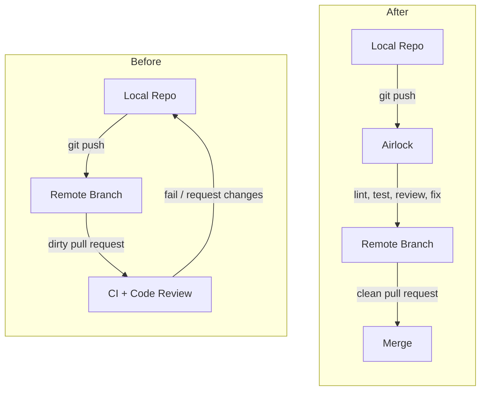

# Airlock

[](https://github.com/airlock-hq/airlock/actions/workflows/ci.yml)
[](https://github.com/airlock-hq/airlock/releases/latest)
[](LICENSE)
[]()
[](https://airlockhq.com)
[](https://x.com/Airlock_HQ)

Vibe code in. Clean PR out. Self-healing local CI for high-velocity agentic engineering.

Airlock is a local Git proxy that intercepts `git push`, runs your code through a customizable validation pipeline, and lets you approve before anything is pushed to remote. Think of it as an airlock between your local repo and the outside world.



## Install

```bash
brew install --cask airlock-hq/airlock/airlock
```

macOS only for now. More platforms coming soon.

## Quick Start

```bash
cd your-project
airlock init      # sets up local git gate
git push origin feature-branch   # triggers the pipeline
```

That's it. Airlock intercepts the push, runs your pipeline, and opens a **Push Request** in the desktop app for self-review. When you approve, it forwards to GitHub and creates a PR.

To bypass Airlock at any time: `git push upstream main`

## What It Does

Your agents are writing a ton of code, fast. How do you review and merge the code at the same pace, with confidence?

Airlock handles the basic review, validation and clean up, so you can focus on more important decisions.

| Before            | After                         |
| ----------------- | ----------------------------- |
| Lint errors       | All lints pass                |
| No tests          | Tests generated & passing     |
| No docs           | Functions documented          |
| No PR description | Rich summary with walkthrough |
| Hardcoded secrets | Flagged for review            |

## How It Works

1. `airlock init` reroutes your `origin` remote to a local bare repo (a "gate")
2. When you `git push`, a daemon picks up the push and runs your pipeline
3. Pipeline jobs run in a temporary worktree — lint, test, describe, review
4. Results appear as a **Push Request** you can review in the Airlock desktop app
5. You review and approve the change to exit the airlock, get pushed upstream and become a clean PR

### Pipeline

Defined in `.airlock/config.yml` using a familiar YAML workflow syntax:

```yaml
steps:
  - name: rebase
    uses: airlock-hq/airlock/defaults/rebase@main
  - name: lint
    uses: airlock-hq/airlock/defaults/lint@main
  - name: freeze
    run: airlock exec freeze
  - name: describe
    uses: airlock-hq/airlock/defaults/describe@main
  - name: document
    uses: airlock-hq/airlock/defaults/document@main
  - name: test
    uses: airlock-hq/airlock/defaults/test@main
  - name: push
    uses: airlock-hq/airlock/defaults/push@main
    require-approval: true
  - name: create-pr
    uses: airlock-hq/airlock/defaults/create-pr@main
```

The **freeze** step splits the pipeline: stages before it auto-apply fixes (formatting, lint), stages after it produce review artifacts without modifying code.

Steps can be inline shell commands or reusable definitions loaded from Git repos via `uses:`.

## Architecture

```
crates/
├── airlock-cli/      # CLI binary
├── airlock-daemon/   # Background daemon (watches for pushes)
├── airlock-core/     # Core library (git ops, config, pipeline)
├── airlock-app/      # Desktop app (Tauri + React)
└── airlock-fixtures/ # Test fixtures
defaults/             # Built-in reusable pipeline steps
packages/
└── design-system/    # Shared UI components
```

Built with Rust + TypeScript. Desktop app uses Tauri.

## Development

```bash
make dev      # Start desktop app with hot reload
make build    # Build everything
make test     # Run all tests
make check    # Clippy + format + lint checks
```

Run `make help` for all available commands.

## Status

Alpha. Expect rough edges. We're building in the open.

## License

[MIT](LICENSE)
